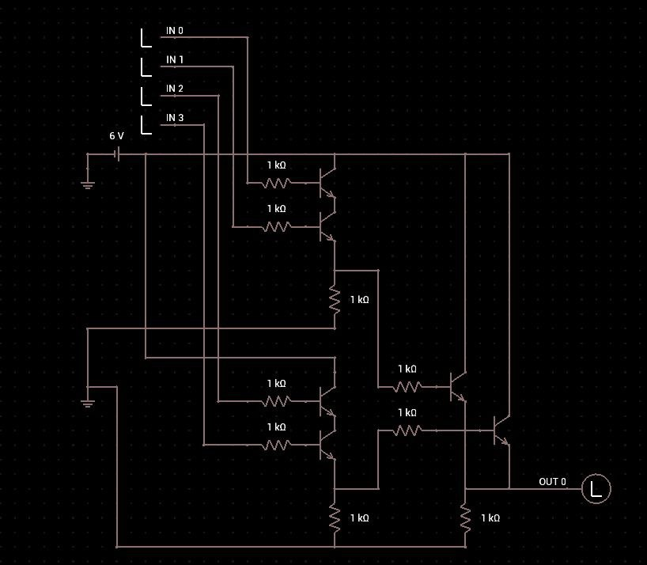

# Low Logic - HTB Challenge
El ejercicio consta de un diagrama de compuertas logicas, en el cual se toman 4 inputs(`in0,in1,in2,in3`).

`in0` e `in1` funcionan como input para la primera operación AND, e `in2` e `in3` funcionan como input para la segunda operación AND. Los outputs de estas dos operaciones son el input de una operación OR, la cual nos da el resultado final del ejercicio en código binario.
Como parte de este challenge se nos provee un `.csv` el cual contiene los distintos inputs que recibira el diagrama.

``` csv
in0,in1,in2,in3
1,0,0,1
1,1,0,0
0,1,1,0
0,0,1,0
1,1,0,1
1,0,0,1
0,0,0,0
0,0,1,0
0,0,0,0
0,1,1,1
0,0,0,0
1,1,1,1
0,0,1,0
1,0,1,1
1,0,0,0
0,0,0,0
0,0,1,0
0,1,1,1
...<SNIP>...
```
Dado este diagrama con la lógica del circuito y el `.csv` presente con la secuencia de inputs, realicé un script simple en Python el cual recibe el `.csv`, toma cada valor de cada fila y realiza las operaciones AND para posteriormente pasar los resultados de dichas operaciones a una OR. Guardo el código binario resultante de la OR y lo transformo en caracteres humanamente legibles.

``` python
#!/usr/bin/env python3

import csv

filename = 'input.csv'

rows = []
with open(filename, newline='') as f:
    lector = csv.reader(f, delimiter=',')
    header = next(lector)
    for f in lector:
        integers = [int(x) for x in f if x != '']
        rows.append(integers)

result = ''
for r in rows:
    int0, int1, int2, int3 = r
    and0 = int0 & int1
    and1 = int2 & int3
    xor_final = str(and0 | and1)
    result += xor_final

flag = ''
for i in range(0, len(result), 8):
    flag += chr(int(result[i:i+8], 2))
print(flag)
```
> [!note] Este es mi primer ejercicio de *hardware hacking*, so es posible que utilice términos incorrectos durante la redacción.
